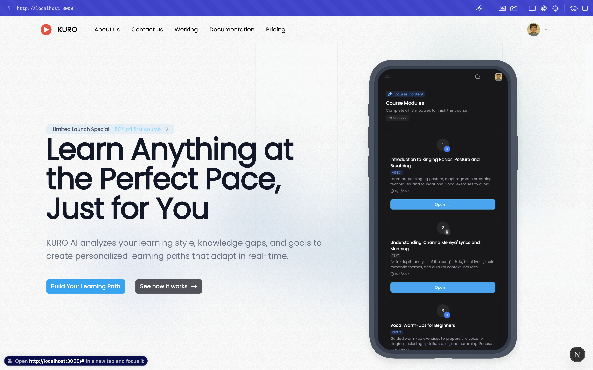
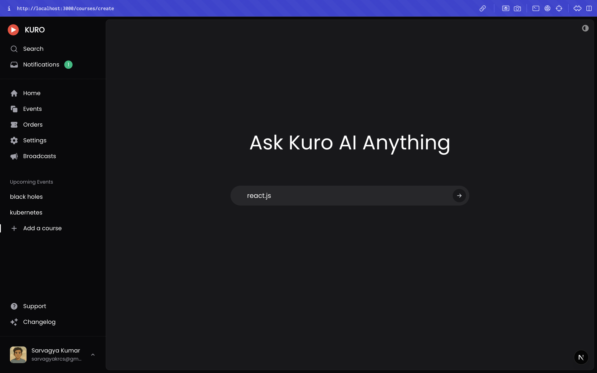
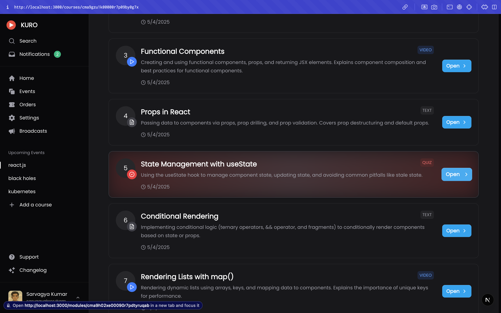
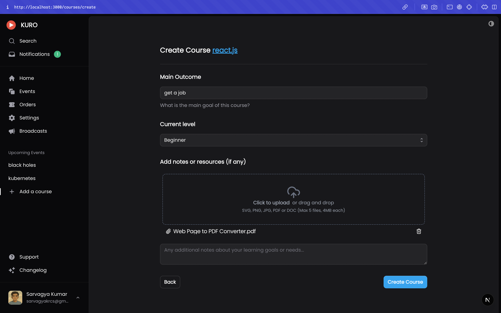
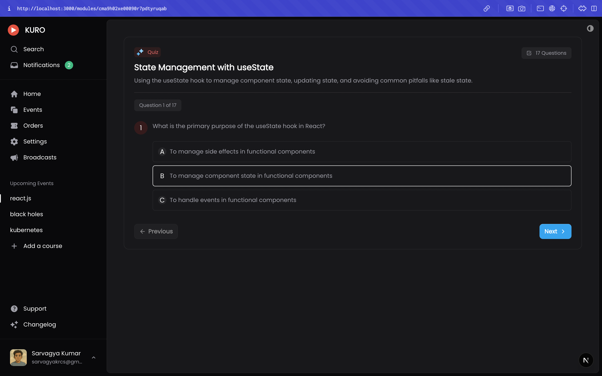
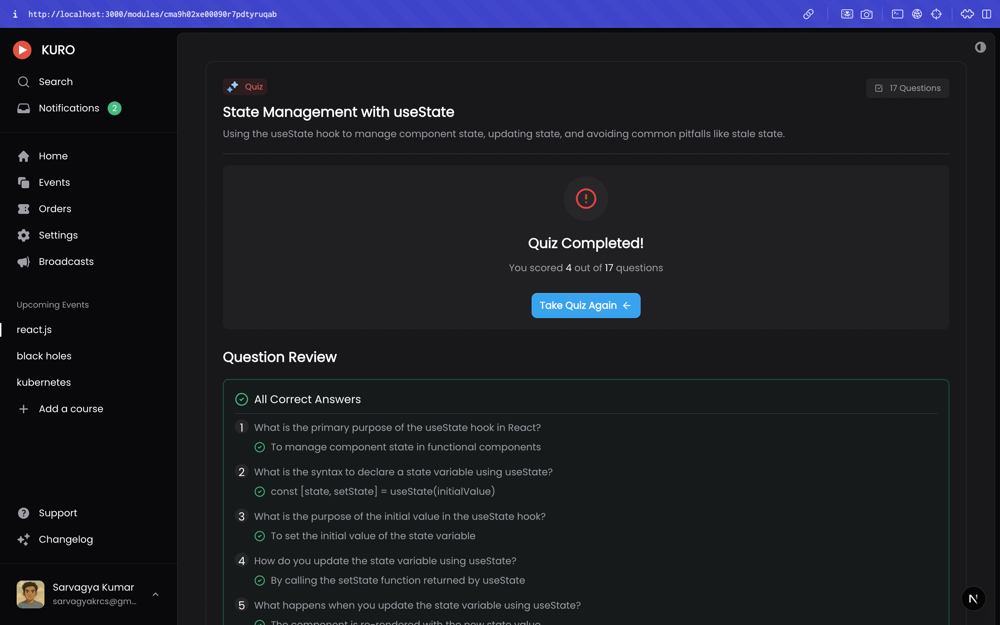
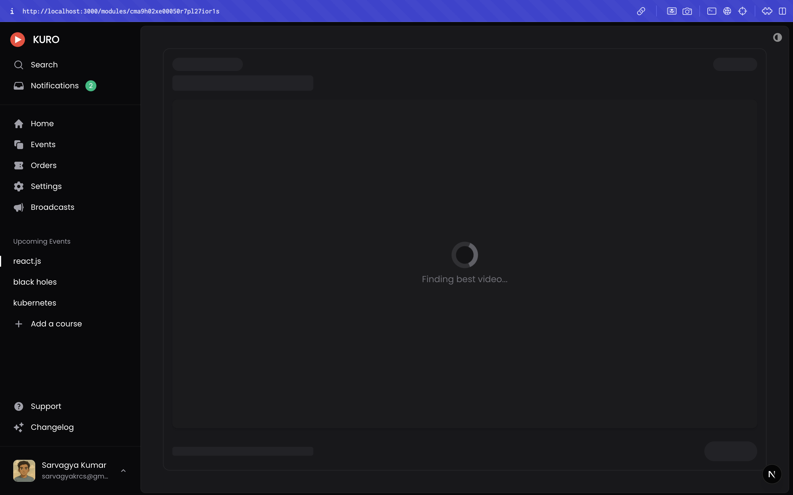

# Kuro : AI Course Generator

A modern web application for generating and managing AI educational courses, built with Next.js, TypeScript, and Tailwind CSS.



## Live Demo

**URL**: [kuro-main.vercel.app](https://kuro-main.vercel.app)

**Test Credentials**:
- Email: test@kuro.com
- Password: password@123

> **⚠️ Important**: The application uses third-party AI APIs with rate limits. If you encounter errors during course generation or other AI-powered features, this may be due to API quotas being exceeded. Please use the test features sparingly.

## Overview

AI Course Generator is a powerful platform that leverages AI to help create, manage, and deliver educational content. The application features authentication, course creation workflows, content management, and more.

## Key Innovations

- **Multi-Modal AI Processing Pipeline**: Proprietary system that combines LLMs with structured knowledge for superior educational content generation
- **Adaptive Learning Path Creation**: Automatically tailors course content based on learner profiles and progress tracking
- **Document Understanding System**: Advanced architecture for extracting knowledge structures from various document formats
- **Real-time Collaborative Course Building**: Multiple educators can simultaneously build and refine course content
- **Semantic Search and Retrieval**: Contextual understanding of course materials for intelligent content recommendation
- **Modular Component Architecture**: Fully customizable UI components that allow for quick iteration and feature deployment
- **Hybrid Content Generation**: Combines AI-generated content with human expertise in a seamless workflow
- **Enterprise-Grade Authentication**: Multi-factor, role-based security system with fine-grained access controls
- **Scalable Processing**: Handles thousands of concurrent users with optimized backend processing
- **Interactive 3D Learning Visualizations**: Three.js-powered knowledge maps and concept visualizations

## Features

- **AI-Powered Course Generation**: Create comprehensive courses tailored to specific topics
- **Authentication System**: Secure user accounts and role-based access
- **Modern UI**: Clean, responsive interface built with Tailwind CSS
- **Content Management**: Organize and structure educational materials
- **File Uploads**: Support for various document formats (PDF, DOCX, etc.)
- **API Integration**: Connect with various AI services for content generation

## Tech Stack

- **Frontend**: React 19, Next.js 15, Tailwind CSS 4
- **Backend**: Next.js API routes, Prisma ORM
- **Database**: Compatible with various databases through Prisma
- **Authentication**: NextAuth v5
- **AI Integration**: LangChain, AI SDK, Google AI, Groq
- **Storage**: AWS S3 compatible storage (R2) for file storage
- **Deployment**: Ready for Vercel deployment
- **3D Visualizations**: Three.js with React Three Fiber
- **Form Handling**: React Hook Form with Zod validation
- **State Management**: Tanstack React Query

## Demo Screenshots

### Course Creation

Create detailed courses with AI assistance. Simply provide a topic and let the AI generate comprehensive course content.

### Course Modules

Organize your course into logical modules with automatically generated learning objectives and content.

### Notes Upload

Upload your existing notes in various formats (PDF, DOCX, etc.) and let the AI transform them into structured course content.

### Quiz Generation

Automatically generate quizzes and assessments based on your course content to test student understanding.

### Quiz Results

Track student performance with detailed analytics and results visualization.

### AI-Based Video Finder

Discover relevant educational videos that complement your course content using AI-powered search.

## Technical Implementation

### AI Integration Architecture
The application uses a multi-model approach with LangChain orchestration:
- **Content Generation**: Groq and Google Generative AI models for course content creation
- **Content Understanding**: Vector embeddings with Pinecone for document similarity and search
- **Document Processing**: PDF parsing with pdf-parse and DOCX parsing with mammoth
- **Chain-of-Thought Processing**: Multi-step reasoning for quiz generation and assessment
- **Retrieval Augmented Generation (RAG)**: Combines knowledge base lookups with generative AI
- **Structured Output Parsing**: Transforms AI completions into structured JSON objects for UI rendering

### Authentication Flow
Secure authentication using NextAuth v5 with:
- GitHub OAuth provider integration
- Email/password authentication with bcrypt hashing
- JWT session management
- Prisma adapter for database storage
- Role-based access control (RBAC)
- Session monitoring and security auditing

### File Processing Pipeline
1. Client-side file upload with react-dropzone
2. Server-side document parsing (PDF, DOCX, XLSX)
3. Content extraction and chunking
4. AI processing and transformation
5. Storage in R2 compatible with AWS S3
6. Automatic metadata extraction and indexing
7. Version control system for document revisions

### Real-time Updates
- Redis for caching and pub/sub messaging
- React Query for optimistic UI updates and data fetching
- WebSocket integration for real-time collaboration
- Background processing queue for resource-intensive operations
- Efficient state synchronization across multiple clients

### Responsive UI Architecture
- Component-based design with Tailwind CSS
- Headless UI components for accessible interactions
- Framer Motion for smooth animations and transitions
- Dark/Light mode support with next-themes
- Mobile-first responsive design principles
- A11y compliance with ARIA support
- Internationalization (i18n) framework

### Performance Optimizations
- Edge caching for static assets
- Dynamic imports and code splitting
- Server components for reduced client-side JavaScript
- Image optimization with next/image
- Streaming server responses
- Database query optimization with Prisma
- Efficient re-rendering with memoization

## Getting Started

### Prerequisites

- Node.js 18+ or Bun
- A database (PostgreSQL recommended)
- API keys for AI services (see Environment Variables)

> **Note**: For local development, you'll need your own API keys. The test credentials provided above are for the demo site only and have limited usage quotas.

### Installation

1. Clone the repository:

```bash
git clone https://github.com/yourusername/ai-course-generator.git
cd ai-course-generator
```

2. Install dependencies:

```bash
npm install
# or
bun install
```

3. Set up your environment variables:

Create a `.env` file in the root directory with the following variables:
```
AUTH_SECRET=""

DATABASE_URL=""
DIRECT_URL=""

REDIS_URL=""

AUTH_GITHUB_ID=""
AUTH_GITHUB_SECRET=""

RESEND_API_KEY=""
GROQ_API_KEY=""
GOOGLE_GENERATIVE_AI_API_KEY=""

R2_ACCOUNT_ID=""
R2_ACCESS_KEY_ID=""
R2_SECRET_ACCESS_KEY=""
R2_BUCKET_NAME=""
R2_PUBLIC_URL=""
```
4. Initialize the database:

```bash
npx prisma db push
```

5. Run the development server:

```bash
npm run dev
# or
bun dev
```

Open [http://localhost:3000](http://localhost:3000) with your browser to see the result.

## Project Structure

- `app/` - Next.js app router pages and layouts
- `components/` - Reusable UI components
- `actions/` - Server actions for data mutations
- `lib/` - Utility functions and shared logic
- `modules/` - Feature-specific module code
- `prisma/` - Database schema and migrations
- `public/` - Static assets
- `styles/` - Global styles
- `types/` - TypeScript type definitions

## System Architecture

```
┌─────────────────┐      ┌─────────────────┐      ┌─────────────────┐
│                 │      │                 │      │                 │
│  Client Layer   │◄────►│  Service Layer  │◄────►│   Data Layer    │
│  (Next.js UI)   │      │  (API Routes)   │      │  (DB + Cache)   │
│                 │      │                 │      │                 │
└─────────────────┘      └─────────────────┘      └─────────────────┘
        │                         │                        │
        │                         │                        │
        ▼                         ▼                        ▼
┌─────────────────┐      ┌─────────────────┐      ┌─────────────────┐
│                 │      │                 │      │                 │
│    UI State     │      │  AI Pipeline    │      │  Storage Layer  │
│  (React Query)  │      │  (LangChain)    │      │  (S3/R2)        │
│                 │      │                 │      │                 │
└─────────────────┘      └─────────────────┘      └─────────────────┘
```

## Contributing

Contributions are welcome! Please feel free to submit a Pull Request.

## License

This project is licensed under the MIT License - see the LICENSE file for details.

## Acknowledgments

- Built with Next.js and Tailwind CSS
- Leverages various AI technologies for content generation

